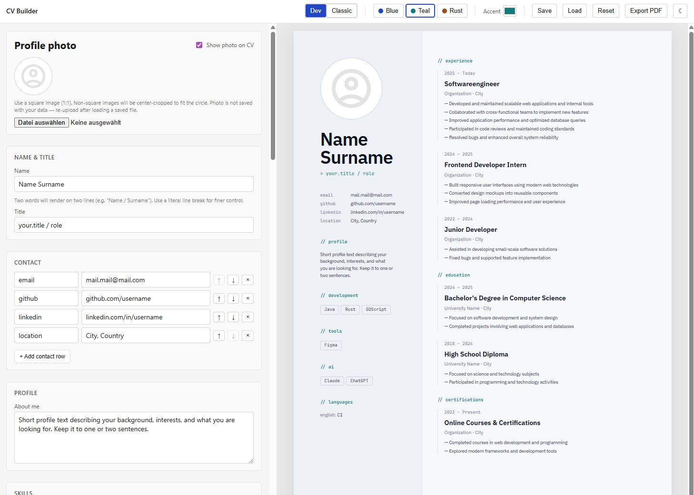

# CV Builder

**This project is deprecated and no longer maintained. The web version will be deactivated soon.**

A new, improved version called **Application Forge** is currently in development, featuring more functionalities and an enhanced UI. You can find it here:
**[https://github.com/PaulRiisk/application-forge](https://github.com/PaulRiisk/application-forge)**

---

A small open-source web tool to build a CV with a live A4 preview and PDF export. Single-file, single-user, no backend.

### → [Open the CV Builder](https://paulriisk.github.io/cv-builder/) (Link will be deactivated soon)



## Features

- Fill the form on the left, see a live A4 preview on the right.
- Two layout modes: **Dev** (with `>` and `//` accents) and **Classic** (clean, capitalized headings).
- Theme presets (Blue / Teal / Rust) plus a custom accent color picker.
- Light and dark mode for the editor UI; the CV preview stays light.
- Optional profile photo with a one-click on/off toggle.
- Save your data to a JSON file, load it back later.
- Export the preview as an A4 PDF.

## Privacy

This is a non-commercial, single-page tool. Nothing leaves your browser:

- All form data is stored in your browser's `localStorage`.
- The profile photo is held in memory only — not in `localStorage`, not in the exported JSON. You re-upload it after loading a saved file.
- No analytics, no cookies, no tracking, no backend.
- Fonts are bundled with the app, so the page makes no third-party requests at runtime.

## Run locally

Requirements: Node 18+.

```bash
npm install
npm run dev
```

Open the URL printed by Vite (typically <http://localhost:5173/>).

## Build

```bash
npm run build
```

Static output goes to `dist/` and can be deployed to any static host.

## Tech

React + TypeScript + Vite, plain CSS with CSS variables, html2pdf.js for export. Self-hosted fonts via `@fontsource`. State lives in a single `useReducer` exposed via Context.

## License

MIT
